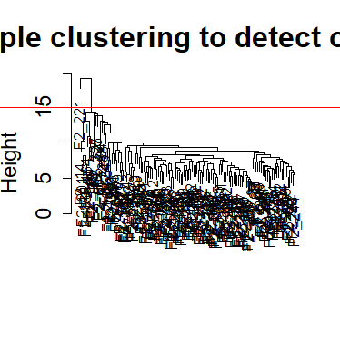
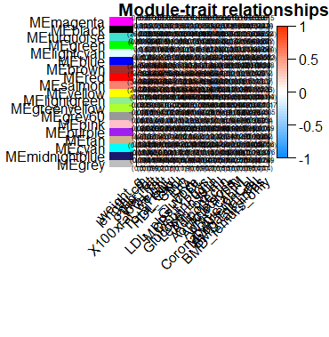

```{r setup, include=FALSE}
knitr::opts_chunk$set(echo = TRUE)
```

## WGCNA

**a) Instalar la biblioteca WGCNA**

``` {.r}
install.packages(c("matrixStats", "Hmisc", "splines", "foreach", "doParallel", "fastcluster", "dynamicTreeCut", "survival"))
BiocManager::install(c("GO.db", "preprocessCore", "impute"));

install.packages("WGCNA")
library("WGCNA")
```

**b) Sigue el tutorial , es decir, en un Rmarkdown ve corriendo lo que marca el tutoral, 1. *Networks analysis of liver expression data* . . . para construir una red de co expresion**

## **1. Preliminares y entrada de datos** 

``` {.r}
#No se para que sirva pero decia no omitir 
options(stringsAsFactors = FALSE)
#Cargar la base de datos de higado femenino
femData = read.csv ( "LiverFemale3600.csv" )
```

``` {.r}
#Para mantener los datos que contiene la expresion del gen y los nombres de los genes
datExpr0 = as.data.frame(t(femData[, -c(1:8)]));
names(datExpr0) = femData$substanceBXH;
rownames(datExpr0) = names(femData)[-c(1:8)];
```

``` {.r}
#Comprobar si hay genes con valores faltantes
gsg = goodSamplesGenes(datExpr0, verbose = 3);
gsg$allOK
```

``` {.r}
#Agrupar la matriz transpuesta para identificar los valores atipicos de la muestra
sampleTree = hclust(dist(datExpr0), method = "average");
plot(sampleTree, main = "Sample clustering to detect outliers", sub="", xlab="",
     cex.lab = 1.5, cex.axis = 1.5, cex.main = 2)
  # Linea de corte
abline(h = 15, col = "red");
```



``` {.r}
#Identificar el valor atipico
clust = cutreeStatic ( sampleTree , cutHeight =  15 , minSize =  10 ) 
table ( clust )
```

``` {.r}
#Eliminar el valor atipico y construir el marco de datos principal
keepSamples =  ( clust == 1 )  #se deja el cluster 1
datExpr = datExpr0 [ keepSamples ,  ] 
nGenes =  ncol ( datExpr ) 
nSamples =  nrow ( datExpr )
```

``` {.r}
#Introducir los datos clinicos, prepararlos y depurarlos
traitData = read.csv("ClinicalTraits.csv");
dim(traitData) #dimensiones
names(traitData) #nombres de los datos
# quitar columnas que no se necesitan 
allTraits = traitData[, -c(31, 16)];
allTraits = allTraits[, c(2, 11:36) ];
dim(allTraits) #comprobar dimensiones
names(allTraits) #comprobar nombres
# datos de expresion que tienen los rasgos clinicos
femaleSamples = rownames(datExpr);
traitRows = match(femaleSamples, allTraits$Mice);
datTraits = allTraits[traitRows, -1];
rownames(datTraits) = allTraits[traitRows, 1];
```

``` {.r}
#Repetir la agrupacion de muestras junto con un heat map de los datos fenotipicos
sampleTree2 = hclust ( dist ( datExpr ), method =  "average" ) 
# Convertir rasgos a una representación de color: blanco significa bajo, rojo significa alto, gris significa entrada faltante 
traitColors = numbers2colors(datTraits, signed = FALSE);
#dendograma con colores por rasgos
plotDendroAndColors(sampleTree2, traitColors,
                    groupLabels = names(datTraits),
                    main = "Sample dendrogram and trait heatmap")
```


``` {.r}
#Guardar el archivo como RData
save(datExpr, datTraits, file = "FemaleLiver-01-dataInput.RData" )
```

## **2. Construccion automatica de redes y deteccion de modulos**

``` {.r}
#Esto ayuda a acelerar calculos es como una dependencia de la libreria
allowWGCNAThreads () 
# Carga los datos guardados en la primera parte 
lnames =  load ( file =  "FemaleLiver-01-dataInput.RData" ); 
#La variable lnames contiene los nombres de las variables cargadas.
```

``` {.r}
#detectar modulos y construir una red con WGCNA
#Elegir un conjunto de potencias
powers = c(c(1:10), seq(from = 12, to=20, by=2))
#Funcion de analisis de topologia de red
sft = pickSoftThreshold(datExpr, powerVector = powers, verbose = 5)
#Trazar los resultados
par(mfrow = c(1,2));
#indice de ajuste de topologia sin escala
plot(sft$fitIndices[,1], -sign(sft$fitIndices[,3])*sft$fitIndices[,2],
     xlab="Soft Threshold (power)",ylab="Scale Free Topology Model Fit,signed R^2",type="n",
     main = paste("Scale independence"));
text(sft$fitIndices[,1], -sign(sft$fitIndices[,3])*sft$fitIndices[,2],
     labels=powers,cex=cex1,col="red");
#corte en R cuadrada
abline(h=0.90,col="red")
# grafica de conectividades
plot(sft$fitIndices[,1], sft$fitIndices[,5],
     xlab="Soft Threshold (power)",ylab="Mean Connectivity", type="n",
     main = paste("Mean connectivity"))
text(sft$fitIndices[,1], sft$fitIndices[,5], labels=powers, cex=cex1,col="red")
```


``` {.r}
#CONSTRUCCIÓN DE LA RED
net = blockwiseModules(datExpr, power = 6,
                       TOMType = "unsigned", minModuleSize = 30,
                       reassignThreshold = 0, mergeCutHeight = 0.25,
                       numericLabels = TRUE, pamRespectsDendro = FALSE,
                       saveTOMs = TRUE,
                       saveTOMFileBase = "femaleMouseTOM",
                       verbose = 3)
#Se eligio 6 como la potencia más baja que construye una topologia sin escala. 
#se indico a la funcion que genere modulos de tamaño 30, fusione modulos que sean más del 25 % similares y guarde la matriz de superposición topologica en un objeto
```

``` {.r}
#Cada modulo con su tamaño
table(net$colors)
```

``` {.r}
#Dendograma de agrupacion de los genes
#Convertir etiquetas en colores
mergedColors = labels2colors(net$colors)
# dendograma con colores que indican los modulos
plotDendroAndColors(net$dendrograms[[1]], mergedColors[net$blockGenes[[1]]],
                    "Module colors",
                    dendroLabels = FALSE, hang = 0.03,
                    addGuide = TRUE, guideHang = 0.05)
```


``` {.r}
#Guardar resultados como RData
moduleLabels = net$colors
moduleColors = labels2colors(net$colors)
MEs = net$MEs;
geneTree = net$dendrograms[[1]];
save(MEs, moduleLabels, moduleColors, geneTree,
     file = "FemaleLiver-02-networkConstruction-auto.RData")
```

## **3. Relacionar modulos con informacion externa e identificar genes importantes** 

``` {.r}
#lnames contiene los nombres de las variables cargadas
lnames = load(file = "FemaleLiver-01-dataInput.RData");
lnames
# cargar datos guardados en la segunda parte
lnames = load(file = "FemaleLiver-02-networkConstruction-auto.RData");
lnames
```

``` {.r}
#Cuantificacion de asociaciones modulo-rasgo
# Definir numeros de genes y muestras
nGenes = ncol(datExpr);
nSamples = nrow(datExpr);
# Recalcular los ME con etiquetas de color 
MEs0 = moduleEigengenes(datExpr, moduleColors)$eigengenes
MEs = orderMEs(MEs0)
moduleTraitCor = cor(MEs, datTraits, use = "p");
moduleTraitPvalue = corPvalueStudent(moduleTraitCor, nSamples);
```

``` {.r}
#Visualizar la asociacion modulo-rasgo
#POR COEFICIENTE DE CORRELACION
textMatrix =  paste(signif(moduleTraitCor, 2), "\n(",
                    signif(moduleTraitPvalue, 1), ")", sep = "");
dim(textMatrix) = dim(moduleTraitCor)
par(mar = c(6, 8, 1, 1));
#heatmap plot
labeledHeatmap(Matrix = moduleTraitCor,
               xLabels = names(datTraits),
               yLabels = names(MEs),
               ySymbols = names(MEs),
               colorLabels = FALSE,
               colors = blueWhiteRed(50),
               textMatrix = textMatrix,
               setStdMargins = FALSE,
               cex.text = 0.5,
               zlim = c(-1,1),
               main = paste("Module-trait relationships"))
```



``` {.r}
#Archivo de anotación de sonda 
annot = read.csv(file = "GeneAnnotation.csv");
dim(annot)
names(annot)
probes = names(datExpr)
probes2annot = match(probes, annot$substanceBXH)
# numeros de anotacion
sum(is.na(probes2annot))
#si devuelve 0 wuuuu
```

``` {.r}
#Recopile toda la informacion de genes significativos relacionados con el peso corporal
# datos crudos
geneInfo0 = data.frame(substanceBXH = probes,
                       geneSymbol = annot$gene_symbol[probes2annot],
                       LocusLinkID = annot$LocusLinkID[probes2annot],
                       moduleColor = moduleColors,
                       geneTraitSignificance,
                       GSPvalue)
# ordenar por la importancia del peso
modOrder = order(-abs(cor(MEs, weight, use = "p")));
# agregar info importante
for (mod in 1:ncol(geneModuleMembership))
{
  oldNames = names(geneInfo0)
  geneInfo0 = data.frame(geneInfo0, geneModuleMembership[, modOrder[mod]],
                         MMPvalue[, modOrder[mod]]);
  names(geneInfo0) = c(oldNames, paste("MM.", modNames[modOrder[mod]], sep=""),
                       paste("p.MM.", modNames[modOrder[mod]], sep=""))
}
# Ordene los genes en la variable geneInfo y por geneTraitSignificance
geneOrder = order(geneInfo0$moduleColor, -abs(geneInfo0$GS.weight));
geneInfo = geneInfo0[geneOrder, ]
```

``` {.r}
#Guardar los resultados en un archivo de salida
write.csv(geneInfo, file = "geneInfo.csv")
```

## **4. Interconectar el analisis de redes con otros datos, como la anotacion funcional y la ontologia de genes**

``` {.r}
#cargar los datos de expresion de la parte 1
lnames = load(file = "FemaleLiver-01-dataInput.RData");
#cargar la variable de los nombres de las variables guardadas
lnames
# datos de red de la parte 2
lnames = load(file = "FemaleLiver-02-networkConstruction-auto.RData");
lnames
```

``` {.r}
##leer la anotacion de la sonda
annot = read.csv(file = "GeneAnnotation.csv");
#juntar las sondas con los archivos de anotacion
probes = names(datExpr)
probes2annot = match(probes, annot$substanceBXH)
# ID de Locuis Link
allLLIDs = annot$LocusLinkID[probes2annot];
# elegir con $ los modulos interesantes
intModules = c("brown", "red", "salmon")
for (module in intModules)
{
  # seleccionar modulos
  modGenes = (moduleColors==module)
  # ID codes
  modLLIDs = allLLIDs[modGenes];
  # para escribirlos en un archivo
  fileName = paste("LocusLinkIDs-", module, ".txt", sep="");
  write.table(as.data.frame(modLLIDs), file = fileName,
              row.names = FALSE, col.names = FALSE)
}
# se usan todas las sondas para el analisis de enriquesimiento
fileName = paste("LocusLinkIDs-all.txt", sep="");
write.table(as.data.frame(allLLIDs), file = fileName,
            row.names = FALSE, col.names = FALSE)
```

``` {.r}
tab = GOenr$bestPTerms[[4]]$enrichment
names(tab)
write.table(tab, file = "GOEnrichmentTable.csv", sep = ",", quote = TRUE, row.names = FALSE)
keepCols = c(1, 2, 5, 6, 7, 12, 13);
screenTab = tab[, keepCols];
# Redondea las columnas numericas a 2 decimales
numCols = c(3, 4);
screenTab[, numCols] = signif(apply(screenTab[, numCols], 2, as.numeric), 2)
# especificar que el max sea de 40 caracteres
screenTab[, 7] = substring(screenTab[, 7], 1, 40)
# nombres de las columnas
colnames(screenTab) = c("module", "size", "p-val", "Bonf", "nInTerm", "ont", "term name");
rownames(screenTab) = NULL;
options(width=95)
# para ver la tabla
screenTab
```

## **5. Exportación de redes a software externo** 

``` {.r}
# datos de expresion de parte 1
lnames = load(file = "FemaleLiver-01-dataInput.RData");
lnames
# datos de parte 2
lnames = load(file = "FemaleLiver-02-networkConstruction-auto.RData");
lnames
```

``` {.r}
# si no corre puede ser la topologia, cargar de nuevo esto:
TOM = TOMsimilarityFromExpr(datExpr, power = 6);
# archivo de anotacion
annot = read.csv(file = "GeneAnnotation.csv");
# Seleccionar modulos
modules = c("brown", "red");
# seleccionar sondas
probes = names(datExpr)
inModule = is.finite(match(moduleColors, modules));
modProbes = probes[inModule];
modGenes = annot$gene_symbol[match(modProbes, annot$substanceBXH)];
# supersicion topologica
modTOM = TOM[inModule, inModule];
dimnames(modTOM) = list(modProbes, modProbes)
# exportar la red 
cyt = exportNetworkToCytoscape(modTOM,
                               edgeFile = paste("CytoscapeInput-edges-", paste(modules, collapse="-"), ".txt", sep=""),
                               nodeFile = paste("CytoscapeInput-nodes-", paste(modules, collapse="-"), ".txt", sep=""),
                               weighted = TRUE,
                               threshold = 0.5,
                               nodeNames = modProbes,
                               altNodeNames = modGenes,
                               nodeAttr = moduleColors[inModule]);
```

**c) a partir de los datos del tutorial responde las siguientes preguntas:**

i\. En donde esta el objeto matriz de expresion y de que dimension es?

ii\. ¿Por que se eliminan datos que son demasiado distintos ? (Vean la grafica Sample clustering to detect outliers)

iii\. ¿Que criterio utilizan para generar la red, es decir explica el significado de la variable softpower

iv\. ¿Por que crees que genes que pertenecen al mismo cluster sin relevantes.

v\. Discute algunos de los resultados que te parezcan interesantes de los clusters y su relacion con los metadatos ( datos de loas hembras ratones).
