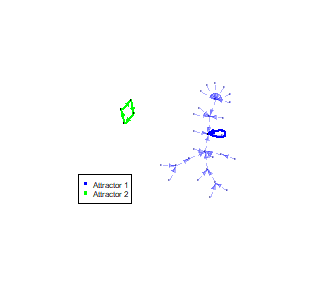

```{r setup, include=FALSE}
knitr::opts_chunk$set(echo = TRUE)
```

## Red booleana

Genera una red de regulacion transripcional con 5 nodos y, al menos, 7 interacciones regulatorias, escoge al menos 3 inhibiciones)

*Escribe las tablas de verdad de las reglas*

+-----+-----+--------------+
| A   | E   | A, A AND E   |
+=====+=====+==============+
| 0   | 0   | 0            |
+-----+-----+--------------+
| 0   | 1   | 0            |
+-----+-----+--------------+
| 1   | 0   | 0            |
+-----+-----+--------------+
| 1   | 1   | 1            |
+-----+-----+--------------+

+---------+--------------------------+
| A       | B, NOT A                 |
+=========+==========================+
| 0       | 1                        |
+---------+--------------------------+
| 1       | 0                        |
+---------+--------------------------+

+--------+---------+-------------------------+
| B      | C       | C, B AND C              |
+========+=========+=========================+
| 0      | 0       | 0                       |
+--------+---------+-------------------------+
| 0      | 1       | 0                       |
+--------+---------+-------------------------+
| 1      | 0       | 0                       |
+--------+---------+-------------------------+
| 1      | 1       | 1                       |
+--------+---------+-------------------------+

+--------+---------+------------------------------+
| C      | E       | D, C AND NOT E               |
+========+=========+==============================+
| 0      | 0       | 0                            |
+--------+---------+------------------------------+
| 0      | 1       | 0                            |
+--------+---------+------------------------------+
| 1      | 0       | 1                            |
+--------+---------+------------------------------+
| 1      | 1       | 0                            |
+--------+---------+------------------------------+

+--------+---------+-----------------------------+
| D      | A       | E, D AND NOT A              |
+========+=========+=============================+
| 0      | 0       | 0                           |
+--------+---------+-----------------------------+
| 0      | 1       | 0                           |
+--------+---------+-----------------------------+
| 1      | 0       | 1                           |
+--------+---------+-----------------------------+
| 1      | 1       | 0                           |
+--------+---------+-----------------------------+

*Escribe las reglas para generar una red de tipo Boolnet.*

``` {.r}
# Instrucciones en el archivo de texto plano:
# A, A & E
# B, !A
# C, B & C
# D, C & !E
# E, D & !A

#cargar la siguiente libreria: 
library("BoolNet")
#cargar como red booleana con la siguiente funcion:
red_bool <- loadNetwork("red.txt")
```

*Encuentra todos los atractores de tu red*

``` {.r}
atractores <- getAttractors(red_bool)
```

**Cual seria el estado final mas probable**

Que todos los genes esten apagados excepto B= 01000

**Dibuja todos los estados y sus atractores**

``` {.r}
plotAttractors(atractores)
plotStateGraph(atractores)
```

{width="267"}

{width="267"}


