```{r setup, include=FALSE}
knitr::opts_chunk$set(echo = TRUE)
```

## Red de co-gustos

*A partir de las dos versiones de la red de co-gustos: la dicotomica (D) y la pesada (P).*

``` {.r}
#Cargar la base de datos
series <- read.csv("gustos.csv")
#Asignar los nombres a los renglones
row.names(series)<- series[,1]
#Quitar la primer columna
series<-series[,-1]
#Hacer una matriz de correlación
matrizcor <- cor(t(series))
matrizad <- (1+matrizcor)/2
#Asignar 0 a los valores de la diagonal
diag(matrizad)<-0

#Red dicotomica
matrizD <- ifelse(matrizad>0.5,1,0)

#Red pesada
matrizP <- (2+matrizcor)/1.5
diag(matriz2)<-0
matrizP <- ifelse(matriz2>0,1,2)
```

**Elabora un programa en R que calcule**

**Dibuja la red con al menos tres layouts (D y P).**

``` {.r}
#Cargar la libreria
library("igraph")
#Convertir a un archivo tipo igraph para la red dicotomica
redD <- graph_from_adjacency_matrix(matrizD,weighted = NULL)
redD

#Dicotomica
plot(redD, layout=layout_as_star)
plot(redD, layout=layout_as_tree)
plot(redD, layout=layout_nicely)

#Convertir a un archivo tipo igraph para la red pesada
redP <- graph_from_adjacency_matrix(matrizP,weighted = NULL)
redP

#Pesada
plot(redP, layout=layout_as_star)
plot(redP, layout=layout_as_tree)
plot(redP, layout=layout_nicely)
```

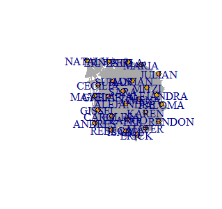{width="210"}

{width="210"}

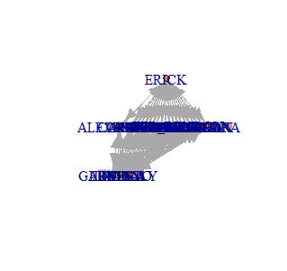{width="209"}

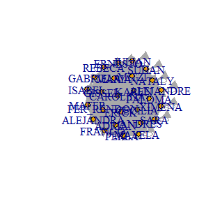{width="204"}

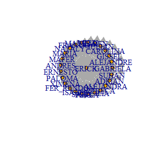{width="205"}

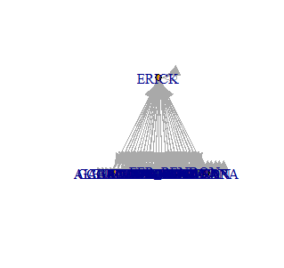{width="205"}

**La distribucion de conectividades (D).**

``` {.r}
#Calcular la distribucion de conectividades entre nodos
distribuciones <- degree.distribution(redD)
#Generar un plot de la distribucion
plot(distribuciones, main="Degree distribution", xlab="Degree", ylab="Frequency")
```


**Los nodos mas conectados (D)**

``` {.r}
#Calcular el degree
d1 <- degree(redD) 
#Ordenar el degree
ordend1 <- sort(d1)
```

*Los nodos mas conectados son Sara y Alejandre con 50 y 48 conexiones respectivamente.*

**Los nodos mas importantes con al menos tres medidas de centralidad (D)**

``` {.r}
#Centralize a graph according to the betweenness of vertices
betw <- centr_betw(redD) #calcular la medida
betw <- as.vector(betw$res) #convertir a vector
names(betw) <- c(1:26) #identificar cada nodo por numero
sort(betw, decreasing = TRUE) #ordenar por medida

#Centralize a graph according to the degrees of vertices
de <- centr_degree(redD)
de <- as.vector(de$res)
names(de) <- c(1:26)
sort(de, decreasing = TRUE)

#Centralize a graph according to the closeness of vertices
clo <- centr_clo(redD)
clo <- as.vector(clo$res)
names(clo) <- c(1:26)
sort(clo, decreasing = TRUE)
```

*Los nodos mas importantes son el 20, 3 y 8.*

-   Los clusters obtenidos con al menos tres metodos de clusterizacion (D y P)

*Red dicotomica*

``` {.r}
#Metodo 1: Community structure via greedy optimization of modularity
cluster1 <- cluster_spinglass(redD)
table(membership(cluster1)) #tamano de los clusters
#dos clusters uno de 14 nodos y el otro de 12

#Metodo 2: Infomap community finding
cluster2 <- cluster_leading_eigen(redD)
table(membership(cluster2)) #tamano de los clusters
#dos clusters uno de 14 nodos y el otro de 12

#Metodo 3: Optimal community structure
cluster3 <- cluster_optimal(redD)
table(membership(cluster3)) #tamano de los clusters
#dos clusters uno de 14 nodos y el otro de 12
```

*Red pesada*

``` {.r}
#Metodo 1: Community structure via greedy optimization of modularity
cluster4 <- cluster_spinglass(redP)
table(membership(cluster1)) #tamano de los clusters
#dos clusters uno de 25 nodos y uno de 1 

#Metodo 2: Infomap community finding
cluster5 <- cluster_leading_eigen(redP)
table(membership(cluster2)) #tamano de los clusters
#un cluster de 26

#Metodo 3: Optimal community structure
cluster6 <- cluster_optimal(redP)
table(membership(cluster3)) #tamano de los clusters
#26 clusters de 1 nodo cada uno

#Plots
plot(cluster1, redD)
plot(cluster2, redD)
plot(cluster3, redD)
plot(cluster4, redP)
plot(cluster5, redP)
plot(cluster6, redP)
```

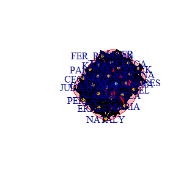{width="209"}

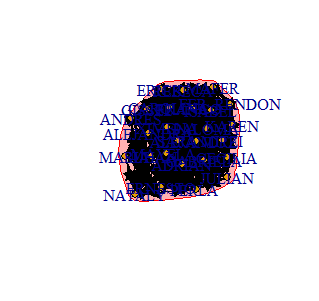{width="207"}

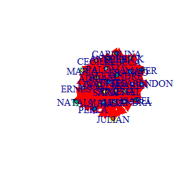{width="206"}

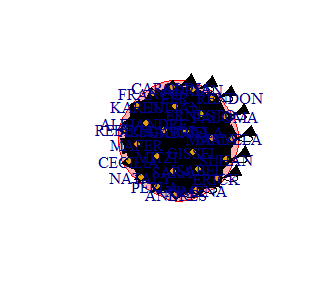{width="205"}

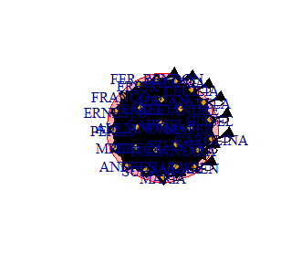{width="205"}

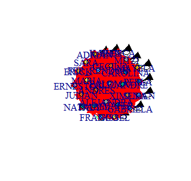{width="206"}

**Discute si las redes (D y P) son dirigidas o no.**

*La red dicotomica y pesada son no dirigidas porque a pesar de que las conexiones no immplican que sean de vueltas, siempre esta establecido una relacion entre ij. Por ejemplo en la matriz de la red dicotomica siempre hay un valor posible entre los nodos que va de 0 a 1 y en la matriz de la red pesada siempre hay valores entre 1 y 2. La conexion si es bidireccional aunque no en la misma medida.*

**¿Como podrias encontrar clicas, si las hay?**

*En un cluster puede haber mas de una clica, porque son pequeños subgrupos mas conectados entre si, pero no lo suficientemente diferentes para formar un cluster nuevo. Matematicamente no se como se podrian encontrar pero creo que visualmente puedes darte cuenta en la matriz de correlacion entre los valores mas parecidos de los nodos que se agrupan en un cluster* *y tratar de definir una clica. Tambien puede ser que veas en la red los nodos que se quedan juntos en diferentes metodos de clusterizacion y considerarlo una clica.*
